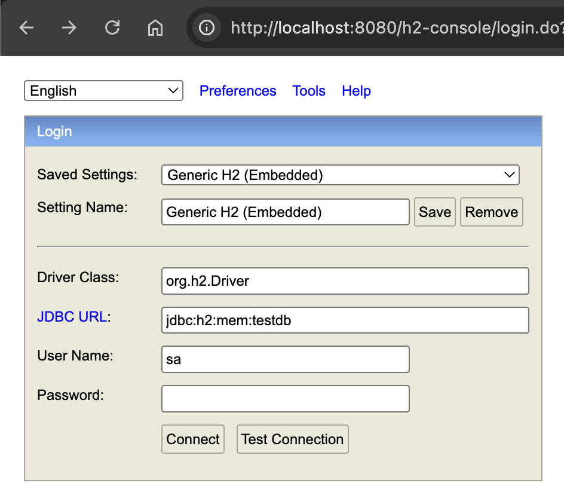

# Migrations avec Flyway

## Lancement du projet 

```bash
./gradlew bootRun
```

:warning: Si la commande ci dessus échoue, vous aurez sûrement besoin d'exécuter cette commande avant : 
```bash
chmod +x gradlew
```

Ensuite il faut aller sur l'interface web de H2, vous pouvez y accéder depuis l'URL `localhost:8080/h2-console`

Il vous demandera de vous connecter, vous utiliserez la configuration suivante : 



## But de l'exercice

Le but de cet exercice va être de créer vous même les tables nécessaires à l'aide d'une migration Flyway.
Vous utiliserez donc le langage SQL pour cela.

Voici les tables à créer :
- Customer
- Post
- Role

Attention, pour la liaison ManyToMany entre `Customer` et `Role`, vous aurez besoin d'une table de jointure.

N'hésitez pas à vous référer à la définition des Entity pour savoir quels attributs mettre dans vos tables.

## Liens

Quelques liens pour vous aider dans votre travail 

[Migrations Flyway](https://medium.com/@bereketberhe27/simplifying-database-migrations-in-spring-boot-with-flyway-a-comprehensive-guide-c778b5dbb922)

[Pourquoi faire des migrations à la main ?](https://hackernoon.com/lang/fr/apprendre-pourquoi-et-comment-utiliser-les-migrations-de-bases-de-donn%C3%A9es-relationnelles)

